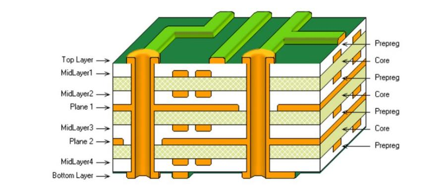
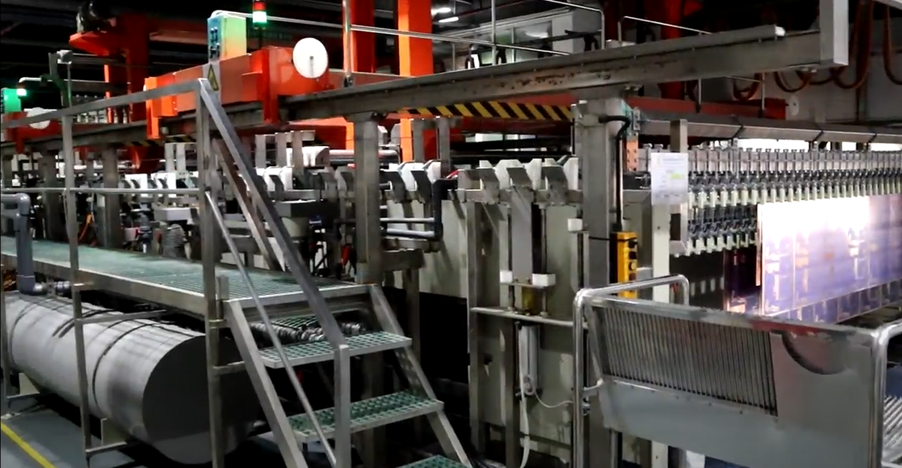
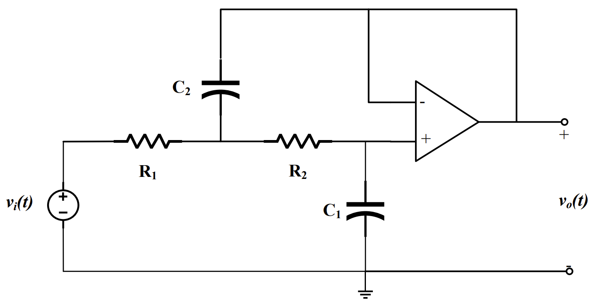
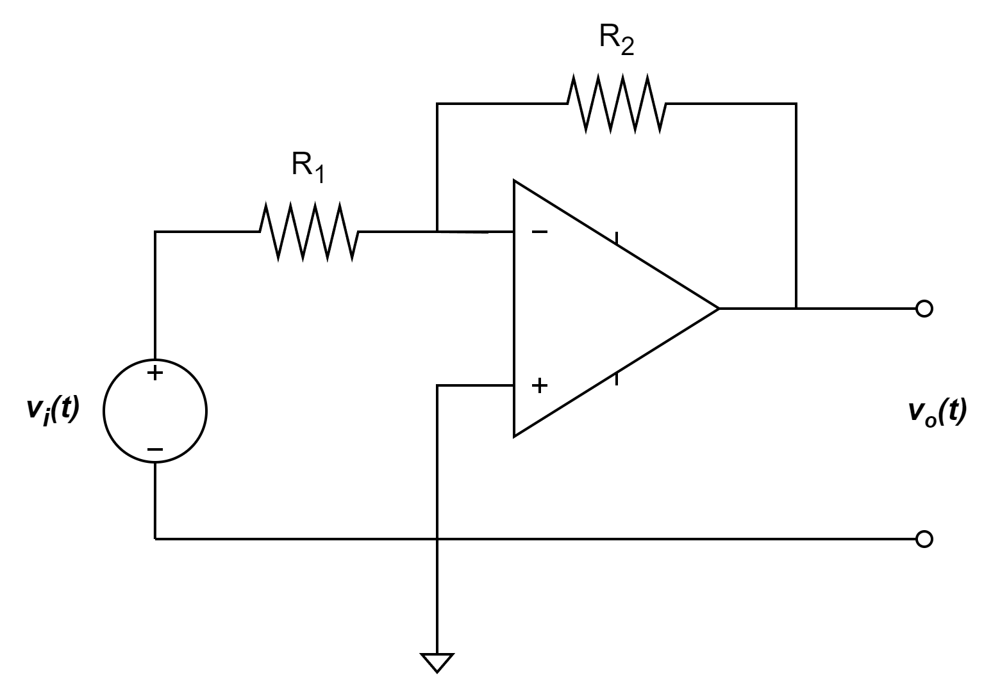
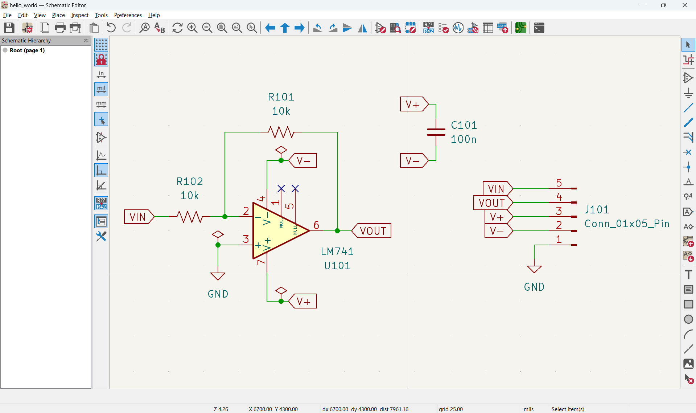
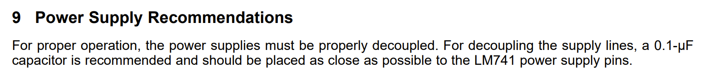
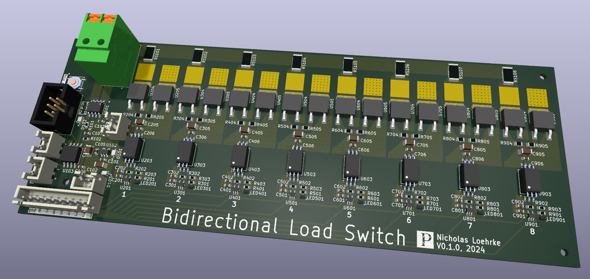

# Designing Printed Circuit Boards

## Scope
- Crash course for absolute beginners
- High level overview of the PCB design process

## What is a PCB?
- Mechanical structure
- Electrical connection

#### Single layer PCB 

> (https://manage.pcbgogo.com/img/js/ueditor/ueditor1.4.3.3/net/upload/image/20190927/6370519083456520006811116.png)

#### Multilayer PCB 

> (https://www.elecrow.com/media/wysiwyg/pcb/multilayer-PCB.jpg)

#### CNC Routing 

> (https://content.instructables.com/FAV/DW48/HHS9JZ8K/FAVDW48HHS9JZ8K.jpg?auto=webp&fit=bounds&frame=1&height=1024&width=1024)

#### PCBWay 

> (https://youtu.be/KKd_TkJRMAs?si=ITFjYFM6-m2PwDht&t=753)

## Designing a PCB
- Schematic capture
- Layout
- Manufacturing
- Assembly

### Lab 5 design

### Simplified design

### Kicad Schematic

### Kicad Layout

### Kicad 3D Render

### Tips
- Tutorials are great, but don't get stuck
- Datasheets are your friend
    - 
    - 
- ERC, DRC
- [Know when to care](https://saturnpcb.com/saturn-pcb-toolkit/)
    - Power
    - Frequency
- Verify footprints

## Resources
- [Kicad 7 YouTube tutorial](https://youtu.be/3FGNw28xBr0?si=RVbsRVqlHxJqC_zx)
- [Multipart Kicad 4 YouTube tutorial](https://youtu.be/vaCVh2SAZY4?si=ZYHfrUdhGqc2HB-z)

## Questions?

## Closing
- Contact info
    - loehrken@uwplatt.edu
- Further opportunities
    - https://github.com/nicholasnloehrke/87s_research
    - 