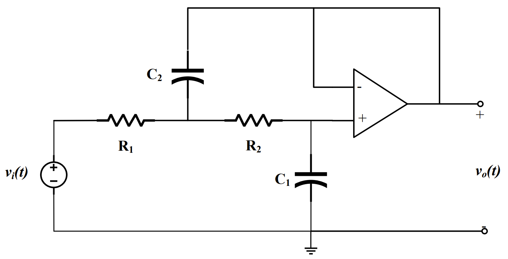
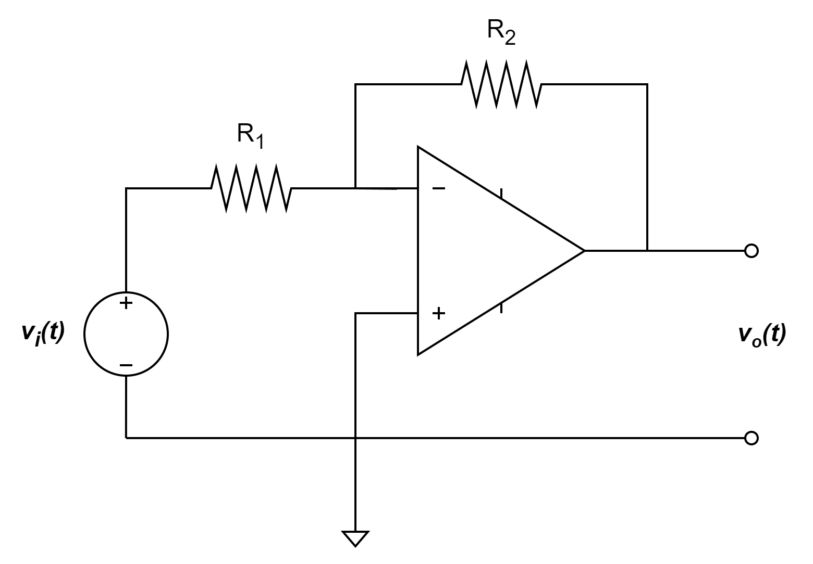
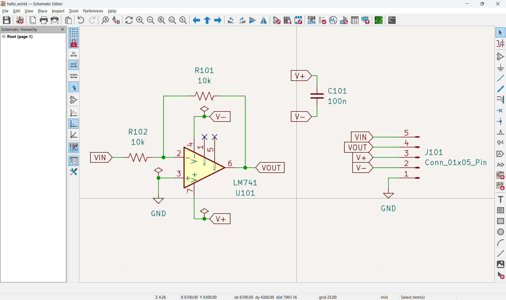
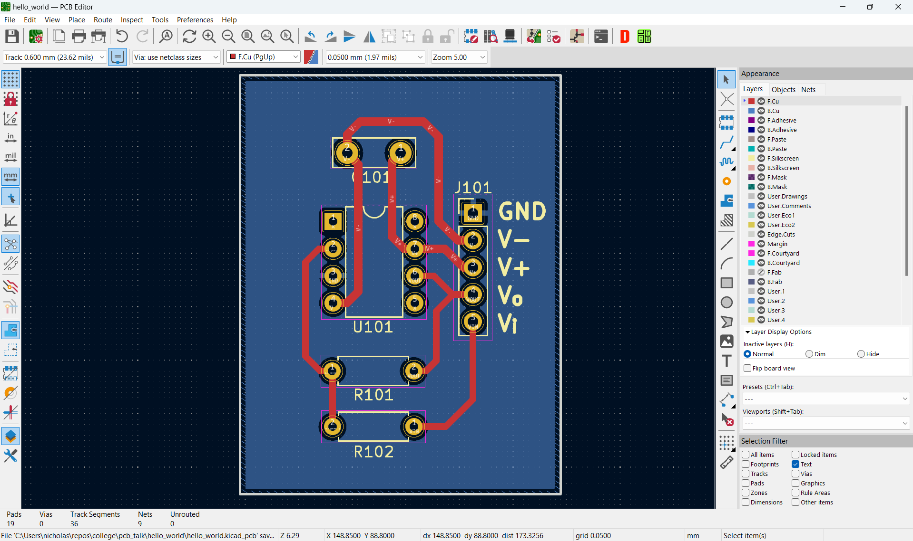
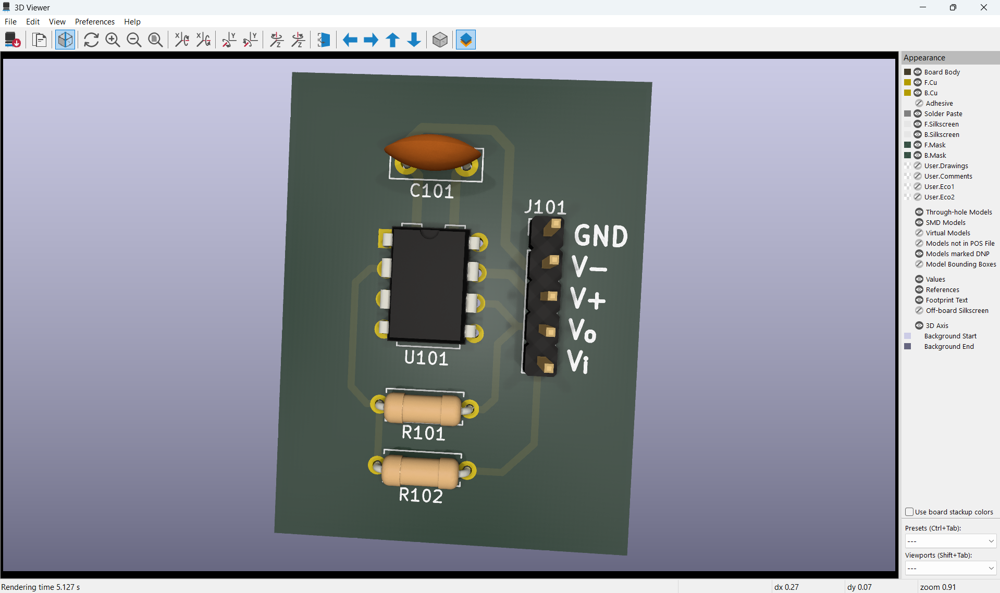

# Designing a Simple Printed Circuit Board

## Who am I

- Nick
- Senior
- EE major, CS minor

## Designing a PCB
- Schematic capture
- Layout
- Manufacturing
- Assembly

### Lab 5 design

### Simplified design

### Kicad Schematic

### Kicad Layout

### Kicad 3D Render

## Resources
### Video 
- [Kicad 7 YouTube tutorial](https://youtu.be/3FGNw28xBr0?si=RVbsRVqlHxJqC_zx)
- [Multipart Kicad 4 tutorial](https://youtu.be/vaCVh2SAZY4?si=ZYHfrUdhGqc2HB-z)